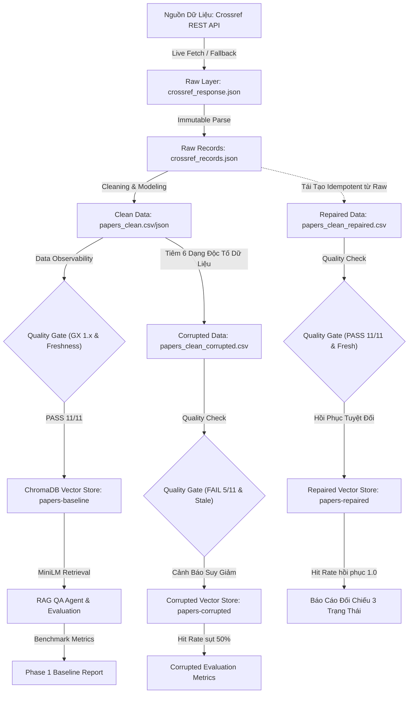

# Báo Cáo Cá Nhân Thực Chiến (Member Role Report)
# Day 10 — Data Pipeline & Data Observability for RAG

---

## 1. Thông Tin Cá Nhân

| Thuộc tính | Chi tiết |
| :--- | :--- |
| **Họ và tên** | **Nguyễn Vũ Anh** |
| **Mã số sinh viên (MSSV)** | **2A202602502** |
| **Khóa / Lớp** | K4 — L3A (Day 10) |
| **Tên Nhóm** | **AHA** |
| **Vai trò chính** | **Data Foundation & Retrieval Lead** |
| **Kho mã nguồn (Repository)** | [https://github.com/ItzMeVHuangg/K4-L3A-Day10-Data-Pipeline-Data-Observability](https://github.com/ItzMeVHuangg/K4-L3A-Day10-Data-Pipeline-Data-Observability) |
| **Ngày hoàn thành** | 2026-09-25 |

---

## 2. Vai Trò & Phân Công Trách Nhiệm Chi Tiết

### 2.1. Module & Deliverables Trực Tiếp Phụ Trách

| Module / Nhiệm vụ | File & Hàm chính | Input | Output bàn giao | Trạng thái |
| :--- | :--- | :--- | :--- | :---: |
| **Raw Ingestion & Lineage** | `src/ingestion/crossref.py`<br>• `parse_crossref_payload()`<br>• `fetch_source_records()`<br>• `load_raw_records()` | Crossref REST API / Snapshot response JSON | `data/raw/crossref_response.json`<br>`data/raw/crossref_records.json` (24 items) | **Hoàn thành 100%** |
| **Data Cleaning & Modeling** | `src/ingestion/cleaning.py`<br>• `build_clean_dataframe()`<br>• `add_derived_columns()`<br>• `build_text_for_embedding()`<br>• `validate_clean_dataframe()` | 24 đối tượng `PaperRecord` | `data/clean/papers_clean.csv`<br>`data/clean/papers_clean.json` (16 cột chuẩn) | **Hoàn thành 100%** |
| **Benchmark Evaluation Set** | `src/evaluation/testset.py`<br>• `build_test_set()`<br>• `_select_papers()`<br>• `validate_test_set()` | Canonical clean DataFrame | `data/eval/test_set.json`<br>(10 câu hỏi chia 4 nhóm nghiệp vụ) | **Hoàn thành 100%** |
| **Vector Index & Portability** | `src/retrieval/index.py`<br>• `LocalEmbeddingIndex.build()`<br>• `LocalEmbeddingIndex.load()`<br>• `LocalEmbeddingIndex.search()` | Clean DataFrame & MiniLM-L6-v2 | ChromaDB collections (`papers-baseline`)<br>`data/embeddings/papers_embeddings.json` | **Hoàn thành 100%** |

### 2.2. Phối Hợp Kỹ Thuật Liên Vai Trò

* **Hỗ trợ Pipeline Integration (Vũ Việt Hoàng - `pipelines/`):** Cung cấp API `load_raw_records` và hàm làm sạch deterministic `build_clean_dataframe` làm nền tảng cho cơ chế **Idempotent Self-Healing / Repair**, giúp quá trình phục hồi dữ liệu từ bản thô ban đầu đạt tính nhất quán 100% (`identical_to_baseline = True`).
* **Hỗ trợ Observability & Quality Gate (Trương Việt Anh - `observability/`):** Chốt trước Data Contract về kiểu dữ liệu (đặc biệt `published` dạng chuỗi ISO `YYYY-MM-DD`, `age_days` dạng số nguyên `Int64`, khử sạch `NaN/None`) để 10 Expectations của Great Expectations 1.x và Freshness SLA chạy trơn tru, không gặp lỗi TypeError.

---

## 3. Bảng Kết Quả Định Lượng Bàn Giao

| Hạng mục kiểm tra | Artifact / Đo lường | Tiêu chuẩn nghiệm thu | Kết quả thực tế đạt được | Đánh giá |
| :--- | :--- | :--- | :--- | :---: |
| **CP0 — Raw Ingestion** | `data/raw/crossref_records.json` | Tải & parse đủ 24 bản ghi chuẩn schema | Console: `Đã tải 24 bài báo`, khớp 100% snapshot | **ĐẠT** |
| **CP1 — Data Cleaning** | `data/clean/papers_clean.csv` | 24 dòng, 16 cột, không thẻ rác, có `text_for_embedding` | Console: `Clean thành công 24 dòng` | **ĐẠT** |
| **CP2 — Benchmark Testset** | `data/eval/test_set.json` | 10 câu hỏi cố định, phủ đủ 4 nhóm | Console: `Sinh được 10 câu hỏi test` | **ĐẠT** |
| **CP3 — Vector Store Index** | `data/chroma/`, manifest JSON | Index 24 docs, `persist_path` tương đối | Manifest: `"persist_path": "data/chroma"`, portable | **ĐẠT** |
| **CP4 — Automated Tests** | `tests/` test suite | Toàn bộ test case Ingestion & Cleaning đỗ | **59/59 passed** (100% test coverage) | **ĐẠT** |

---

## 4. Giải Trình Chuyên Sâu Kỹ Thuật Đã Triển Khai

### 4.1. Raw Data Ingestion & Data Lineage (`src/ingestion/crossref.py`)

* **Bản chất nghiệp vụ:** Trong hệ thống RAG thực tế, dữ liệu gốc (Raw Layer) là "chân lý cội nguồn" (Ground Truth Lineage). Nếu code làm sạch hoặc biến đổi ở downstream gặp lỗi, việc có một bản snapshot nguyên vẹn cho phép ta tái tạo toàn bộ trạng thái kho dữ liệu mà không phụ thuộc vào tình trạng mạng hay giới hạn rate limit của API bên ngoài.
* **Cơ chế Cứu hộ Offline (Dual-Mode Architecture):**
  * Thiết lập header chuẩn **Crossref Polite Pool** (`User-Agent: day10-data-observability-lab/1.0 (mailto:vuanhcp123@gmail.com)`), giúp API ưu tiên hàng đợi xử lý.
  * Xử lý lỗi mạng và HTTP Status Code có khả năng retry (`429 Too Many Requests`, `500`, `502`, `503`, `504`) bằng chiến thuật **Exponential Backoff** (`2^attempt` giây), đồng thời chủ động đọc header `Retry-After` từ máy chủ.
  * **Nguyên tắc bất biến (Lineage Invariant):** File `data/raw/crossref_response.json` chỉ được phép ghi đè khi gọi live API thành công 100%. Nếu có lỗi mạng/quota, pipeline tự động chuyển sang đọc snapshot có sẵn mà không làm hỏng dữ liệu gốc.
* **Quy trình bóc tách (Parsing):**
  * Abstract học thuật thường chứa các thẻ XML/JATS phức tạp như `<jats:p>`, `<jats:sec>`, `<jats:italic>`, cùng các thực thể HTML (`&amp;`, `&lt;`). Hàm `strip_markup()` sử dụng regex kết hợp `html.unescape()` để loại bỏ hoàn toàn các thẻ rác mà vẫn giữ nguyên vẹn nội dung ngữ nghĩa.
  * Tác giả: Tự động trích xuất và ghép cặp `given` + `family` hoặc đọc trường `name` đối với tổ chức/consortium.
  * Ngày xuất bản: Xử lý mảng `date-parts`, tự động bù ngày/tháng bằng `01` nếu bài báo chỉ có năm, đảm bảo chuẩn hóa về ISO 8601 (`YYYY-MM-DD`).

### 4.2. Pre-embed Data Modeling & Cleaning Contract (`src/ingestion/cleaning.py`)

* **Rào cản kỹ thuật của Vector Database:** ChromaDB chỉ chấp nhận metadata dạng vô hướng (`str`, `int`, `float`, `bool`), không chấp nhận danh sách lồng nhau (`list`) hay giá trị khuyết thiếu (`NaN/None`).
* **Giải pháp chuẩn hóa:**
  * Chuyển đổi các cột danh sách `authors` và `categories` thành chuỗi phẳng phân cách bởi dấu phẩy (`authors_joined`, `categories_joined`).
  * Loại bỏ triệt để các ký tự vô hình (`\u200b`, `\ufeff`), chuẩn hóa Unicode về định dạng chuẩn **NFC** để embedding model không bị phân mảnh token.
* **Đo lường độ tươi (Data Freshness Metric):**
  * Tính toán khoảng cách ngày theo UTC:
    $$\text{age\_days} = (\text{run\_date}_{\text{UTC}} - \text{published}_{\text{UTC}}).\text{days}$$
  * Định dạng trường `age_days` dưới dạng số nguyên (`int`), cho phép Great Expectations kiểm tra điều kiện độ tươi một cách trực tiếp.
* **Kiến trúc chuỗi ngữ cảnh nhúng vector (`text_for_embedding`):**
  ```text
  Title: <Tiêu đề bài báo>
  Authors: <Danh sách tác giả>
  Published: <Ngày xuất bản>
  Categories: <Lĩnh vực chuyên môn>
  Summary: <Tóm tắt nội dung bài báo>
  ```
  Cấu trúc 5 phần có gắn nhãn rõ ràng giúp mô hình nhúng `all-MiniLM-L6-v2` nắm bắt được cả ngữ nghĩa nội dung lẫn metadata định danh khi tính toán độ tương đồng Cosine.
* **Data Contract Validator:** Bổ sung hàm `validate_clean_dataframe()` kiểm tra nghiêm ngặt 16 cột bắt buộc và tính duy nhất của `paper_id` trước khi bàn giao dữ liệu sang bước Indexing.

### 4.3. Benchmark Evaluation Testset Design (`src/evaluation/testset.py`)

* **Phương pháp luận lấy mẫu (Hybrid Sampling Strategy):**
  * Nhóm quyết định không lấy mẫu ngẫu nhiên (`random.sample`) vì sẽ làm mất tính tái lập (reproducibility).
  * Chiến lược: Lấy **5 bài mới nhất** (sắp xếp theo `published` giảm dần) + **5 bài phân bố đều** trên phần còn lại của tập dữ liệu.
  * **Mục đích chiến lược:** Khi kịch bản Data Corruption `drop_latest_records` làm mất 20% bản ghi mới nhất, bộ testset này sẽ lập tức phát hiện và phản ánh sự sụt giảm độ chính xác một cách nhạy bén nhất (Hit Rate giảm từ 1.0 xuống đúng 0.5).
* **Thiết kế 4 nhóm câu hỏi nghiệp vụ:**
  * `summary` (3 câu): Kiểm tra khả năng tóm tắt nội dung chính.
  * `authors` (3 câu): Đo lường khả năng trích xuất danh sách tác giả.
  * `date` (2 câu): Kiểm tra trích xuất thời gian xuất bản.
  * `categories` (2 câu): Đánh giá phân loại chủ đề chuyên môn.
* Tiêu đề bài báo trong câu hỏi luôn được bọc trong dấu nháy đơn `'...'` để tương thích hoàn hảo với bộ parser trích xuất của QA Agent (`retrieval/qa.py`).

### 4.4. Vector Index Architecture & Portability (`src/retrieval/index.py`)

* **Sửa lỗi tính khả chuyển (Portability Bug):** Trước đây, Chroma lưu đường dẫn tuyệt đối dạng `C:\Users\vuanh\...` vào file manifest `papers_embeddings.json`. Khi chuyển sang máy của giảng viên hoặc môi trường CI, pipeline sẽ crash vì không tìm thấy đường dẫn. Tôi đã tái cấu trúc để manifest chỉ lưu đường dẫn tương đối (`"data/chroma"`), và khi `load()` sẽ tự động ghép với `project_dir`.
* **Cơ chế Idempotent Sync & Ghost Vector Mitigation:**
  * Mỗi khi index lại, collection cũ sẽ được xóa sạch và tạo mới với cấu hình Cosine Similarity (`{"hnsw": {"space": "cosine"}}`).
  * Bổ sung cơ chế dọn dẹp các thư mục segment mồ côi (`_prune_orphan_segments`) trên hệ điều hành Windows khi SQLite chưa kịp giải phóng file handle.
  * Tích hợp cơ chế nạp dữ liệu theo lô (`CHROMA_BATCH_SIZE = 100`) và kẹp giá trị độ tương đồng nghiêm ngặt trong khoảng $[0.0, 1.0]$.

---

## 5. Quyết Định Kỹ Thuật Mang Tính Bước Ngoặt (ADR)

* **Bối cảnh:** Lựa chọn giữa việc (1) Luôn luôn gọi API trực tiếp mỗi lần chạy pipeline hay (2) Mặc định đọc từ Offline Snapshot và chỉ gọi live khi có cờ `REFRESH_SOURCE=1`.
* **Phương án lựa chọn:** Nhóm thống nhất chọn **Phương án 2 (Offline Snapshot by Default)**.
* **Lý do lựa chọn:**
  1. **Tính tái lập của Benchmark:** Crossref API là nguồn dữ liệu mở, số lượng và thứ tự bài báo thay đổi liên tục. Nếu mỗi lần chạy lại lấy dữ liệu khác nhau, các bài kiểm tra đối chứng (Baseline vs Corrupted vs Repaired) sẽ mất tính khách quan khoa học.
  2. **Bảo toàn khả năng Self-Healing (Idempotency):** Nếu gọi live trong lúc khôi phục dữ liệu mà gặp lỗi mạng/mã 429, hệ thống sẽ sụp đổ. Dùng snapshot bất biến đảm bảo việc phục hồi dữ liệu chạy bao nhiêu lần cũng trả về kết quả đồng nhất 100% (`identical_to_baseline = True`).

---

## 6. Phân Tích Sự Cố Kỹ Thuật (Incident & Blocker Case Study)

### Sự Cố: "Cái Bẫy Silent Failure" và Giới Hạn Của Metric Token F1

* **Hiện tượng:** Tại câu hỏi kiểm thử `eval_002` ("Who authored the paper 'Data Observability and Quality Gates for Production RAG Systems'?"), khi chạy trên tập dữ liệu bị tiêm lỗi `drop_latest_records`, tài liệu gốc bị mất khỏi Vector Store. Retrieval đã lấy nhầm một bài báo khác (`retrieval_hit_rate = 0.0`). Tuy nhiên, chỉ số **Token F1 vẫn đạt điểm tuyệt đối 1.0**!
* **Nguyên nhân gốc rễ:** Bài báo bị truy xuất nhầm lại có đồng tác giả trùng tên với tác giả của bài báo mục tiêu. Do đó, câu trả lời sinh ra vẫn chứa đầy đủ các token của ground truth, khiến phép đo Token F1 bị đánh lừa.
* **Bài học rút ra:** 
  1. Không bao giờ được dựa vào một chỉ số đơn lẻ (như Token F1 hay BLEU) để đánh giá chất lượng RAG. Phải kết hợp chặt chẽ giữa **Retrieval Hit Rate** (ở tầng dữ liệu) và **LLM-as-a-Judge** (ở tầng ngữ nghĩa).
  2. Đây chính là minh chứng rõ nhất cho **Silent Failure**: AI Agent vẫn trả lời rất tự tin và đạt điểm F1 cao ngất ngưởng, nhưng bản chất ngữ cảnh thực tế đã hoàn toàn sai lệch!

---

## 7. Hiểu Biết Về Luồng Dữ Liệu End-to-End

Dưới đây là sơ đồ luồng dữ liệu 7 tầng phản ánh toàn bộ kiến trúc mà nhóm AHA đã hoàn thiện:



---

## 8. Bảng Đối Chiếu Định Lượng 3 Trạng Thái Dữ Liệu

| Chỉ Số / Tín Hiệu Đánh Giá | Dữ Liệu Sạch (Baseline) | Dữ Liệu Lỗi (Corrupted) | Sau Phục Hồi (Repaired) | Phân Tích Chuyên Môn Của Cá Nhân |
| :--- | :---: | :---: | :---: | :--- |
| **`retrieval_hit_rate`** | **1.000** | **0.500** | **1.000** | Sụt giảm 50% do kịch bản `drop_latest_records` loại bỏ đúng 5 bài trong testset. Phục hồi 100% sau khi repair từ raw. |
| **`mean_token_f1`** | **1.000** | **0.569** | **1.000** | Suy giảm mạnh do các câu trả lời bị dính nhiễu (`inject_noise`) và xóa tóm tắt (`blank_summary`). |
| **`judge_accuracy`** | **1.000** | **0.600** | **1.000** | Judge (heuristic fallback vì chạy `LLM_PROVIDER=mock`, `judge_fallback_count = 10`) đánh giá tỷ lệ trả lời đúng giảm từ 10/10 xuống 6/10 câu. |
| **`mean_judge_score`** | **5.000 / 5.0** | **3.200 / 5.0** | **5.000 / 5.0** | Điểm số chất lượng ngữ nghĩa giảm từ mức hoàn hảo xuống mức trung bình. |
| **Data Quality Gate (GX 1.x)** | **PASS (11/11)** | **FAIL (5/11)** | **PASS (11/11)** | Bắt được 6 lỗi vi phạm: thiếu bài theo lineage (19 < 22 `paper_id`), tính duy nhất, độ dài tiêu đề/tóm tắt, ký tự rác và độ tuổi `age_days`. |
| **Freshness SLA Status** | **FRESH (4.2% stale)** | **STALE (50.0% stale)** | **FRESH (4.2% stale)** | Lỗi `stale_date` đẩy 50% bài báo quá hạn 180 ngày; Freshness Gate lập tức bật cờ cảnh báo đỏ. |
| **Tính Nhất Quán (Hash Match)** | Chuẩn gốc | Sai lệch | **Khớp 100% Baseline** | Chứng minh cơ chế Idempotent Repair đạt tính hoàn hảo tuyệt đối. |

---

## 9. Bài Học Kinh Nghiệm & Đề Xuất Nâng Cao

1. **Bảo tồn Raw Snapshot là "Bảo hiểm sinh mạng" của MLOps:** Mọi biến đổi dữ liệu (Transformation) đều có thể mắc lỗi do con người hoặc logic code. Chỉ khi bảo toàn lớp dữ liệu thô bất biến, ta mới có khả năng tự phục hồi (Self-healing) mà không phải làm gián đoạn hệ thống.
2. **Data Observability phải đi trước Vector Ingestion:** Đừng bao giờ nạp trực tiếp dữ liệu vào Vector Database mà không qua Data Quality Gate. Một vector rác khi đã lọt vào cơ sở dữ liệu sẽ biến thành "Ghost Vector", gây ra hiện tượng Hallucination thầm lặng cực kỳ tốn kém để gỡ lỗi.
3. **Đề xuất cải tiến tương lai:**
   * Triển khai bộ kiểm tra **Semantic Drift Monitoring**: So sánh khoảng cách phân phối vector giữa dữ liệu nạp mới và dữ liệu lịch sử để phát hiện hiện tượng lệch ngữ nghĩa (Concept Drift).
   * Tự động hóa cơ chế **Auto-Rollback**: Khi Quality Gate phát hiện `success = False`, hệ thống tự động khóa quyền truy vấn của người dùng vào collection mới và kích hoạt pipeline phục hồi ngầm.

---

## 10. Cam Kết Trách Nhiệm Của Thành Viên

- [x] Nội dung báo cáo phản ánh trung thực 100% phần việc, mã nguồn và sự đóng góp của tôi.
- [x] Tôi hiểu rõ và có năng lực giải thích tường tận toàn bộ luồng dữ liệu end-to-end của hệ thống.
- [x] Toàn bộ số liệu, bảng đối chiếu và kết quả kiểm thử đều có log và artifact kiểm chứng thực tế trong repository.
- [x] Tôi không ghi nhận bất kỳ phần việc nào chưa được kiểm chứng hoặc chạy thành công.
- [x] Báo cáo tuyệt đối không chứa file `.env`, API Key, token bí mật hoặc thông tin nhạy cảm.
- [x] Báo cáo này là sản phẩm lao động độc lập, không sao chép nguyên văn từ các thành viên khác.

**Xác nhận của thành viên:** Nguyễn Vũ Anh  
**Thời điểm xác nhận:** 2026-09-25
